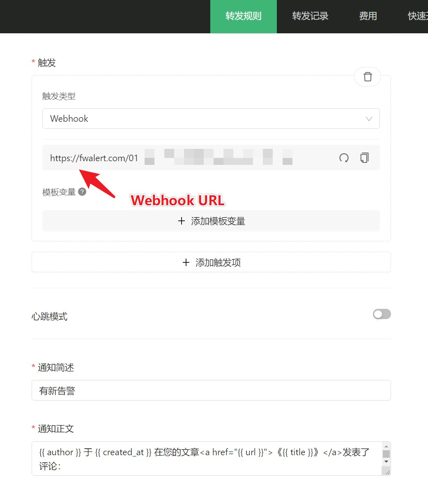

# Comment2Fanwan
Typecho 新评论[饭碗警告](https://fwalert.com/115)通知

## 说明

因为微信服务号模板消息将在 2021.04.30 改版，届时 `Server酱` 将无法正常使用，依赖于它的 `Comment2Wechat` 也将无法正常使用，故开发此插件

## 使用方法

 1. [点此下载](https://github.com/YianAndCode/Comment2Fanwan/archive/master.zip)后解压，将解压后的目录名改为 `Comment2Fanwan`，然后上传到你的 Typecho 的 `/usr/plugins`，并在 Typecho 后台开启插件
 2. 到[饭碗警告](https://fwalert.com/115)里创建规则，并将触发方式设置成 `Webhook`，~~接着创建五个`变量名` 和 `键`为后面所列的`模板变量`：`title`、`author`、`comment`、`created_at`、`url`，~~ 可参考以下截图：
  
  最后在通知正文添加
```
{{ author }} 于 {{ created_at }} 在您的文章<a href="{{ url }}">《{{ title }}》</a>发表了评论：
{{ comment }}
```
  *当然，你也可以按照你的喜好修改文案，本插件会向饭碗推送 `title`、`author`、`comment`、`created_at`、`url` 这几个模板变量，在正文中用诸如 `{{ author}}` 的写法即可，它会动态替换*

 3. 将你创建的规则的 `Webhook` 地址填到插件设置里，保存即可

## TODO：
 [x] 我已经在跟 Mufan 团队沟通，争取通过接口来简化配置规则这一步骤  
 [] 如果你有其他需求，欢迎提 issue